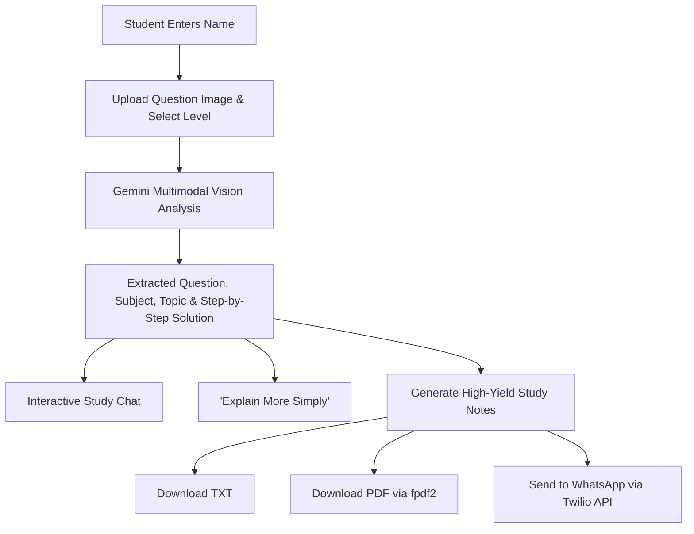

# Snap & Study — AI Vision Study Assistant 🎓📸

> Snap a question. Understand the solution.

**Snap & Study** is an AI-powered multimodal educational web application built with Streamlit and Google Gemini. When a student uploads a photo of a textbook question, handwritten math equation, science problem, or diagram, the AI understands the complete visual context, transcribes the problem, identifies the subject/topic, provides step-by-step educational explanations tailored to the student's level, facilitates follow-up conversations, generates high-yield revision notes, and allows instant export via TXT, styled PDF, or direct delivery to WhatsApp using Twilio.

---

## 1. Features

- **📸 Multimodal Vision Recognition**: Direct image-to-solution processing with Google Gemini Vision models (`gemini-2.5-flash`).
- **🎯 Educational Understanding (Beyond OCR)**: Formulates deep academic understanding rather than basic text extraction.
- **📚 Automatic Subject & Topic Detection**: Categorizes questions into Mathematics, Physics, Chemistry, Biology, Computer Science, English, etc.
- **🎚️ 3 Tailored Explanation Levels**:
  - **Beginner**: Intuitive, plain-English analogies, bite-sized steps, foundational clarity.
  - **Standard**: Classic academic reasoning with formulas, steps, and intermediate logic.
  - **Detailed**: Comprehensive theory, mathematical derivations, common pitfalls, and revision takeaways.
- **🌱 "Explain More Simply" One-Click Mode**: Transforms dense solutions into simple, intuitive breakdowns without losing mathematical accuracy.
- **💬 Context-Aware Interactive Study Chat**: Ask follow-up questions ("Why this formula?", "Give me another example", "Quiz me on this") with full memory of the problem image and past dialogue.
- **📖 Instant Study Notes Generator**: Synthesizes the question, core principles, formulas, and pitfalls into clean revision notes.
- **📥 Multi-Format Export**:
  - Download as formatted `.txt`
  - Export to professionally formatted `.pdf`
  - Send directly to **WhatsApp** via Twilio API.
- **🛡️ Secure & Production-Ready**: Zero hardcoded secrets, session state persistence across Streamlit reruns, and user-friendly error handling.

---

## 2. Tech Stack

| Layer | Technology |
|---|---|
| **Frontend UI** | [Streamlit](https://streamlit.io/) (Python) |
| **Language** | Python 3.11+ |
| **Vision & Reasoning AI** | [Google Gemini](https://ai.google.dev/) (`google-genai` SDK) |
| **Messaging Integration** | [Twilio WhatsApp API](https://www.twilio.com/en-us/messaging/channels/whatsapp) |
| **Document Generation** | `fpdf2` (PDF) |
| **Image Processing** | `Pillow` (PIL) |
| **Deployment Target** | Streamlit Community Cloud |

---

## 3. Architecture & User Workflow



---

## 4. Project Folder Structure

```
snap-and-study/
│
├── app.py                      # Main Streamlit application & routing
├── prompts.py                  # System prompts, templates & instructions
├── requirements.txt            # Python production dependencies
├── README.md                   # Comprehensive documentation
├── .gitignore                  # Git ignore rules for secrets and virtualenvs
│
└── .streamlit/
    ├── secrets.toml            # Private keys (never committed to git)
    └── secrets.toml.example    # Template file for secret configuration
```

---

## 5. Installation & Local Setup

### Step 1: Clone the repository
```bash
git clone https://github.com/yourusername/snap-and-study.git
cd snap-and-study
```

### Step 2: Create and activate a virtual environment
**On macOS/Linux:**
```bash
python3 -m venv venv
source venv/bin/activate
```

**On Windows (PowerShell):**
```powershell
python -m venv venv
.\venv\Scripts\Activate.ps1
```

### Step 3: Install dependencies
```bash
pip install -r requirements.txt
```

---

## 6. API Key Setup

1. Copy `.streamlit/secrets.toml.example` to `.streamlit/secrets.toml`:
```bash
cp .streamlit/secrets.toml.example .streamlit/secrets.toml
```

2. Open `.streamlit/secrets.toml` and configure your credentials:
```toml
# Google Gemini API Key (Get from https://aistudio.google.com/)
GEMINI_API_KEY = "AIzaSy..."

# Twilio Credentials (Optional for WhatsApp feature, from https://console.twilio.com/)
TWILIO_ACCOUNT_SID = "AC..."
TWILIO_AUTH_TOKEN = "your_auth_token"
TWILIO_PHONE_NUMBER = "whatsapp:+14155238886" # Default Twilio sandbox number
TWILIO_CONTENT_SID = ""                       # Optional if using templates
```

> **Note**: If you don't have Twilio credentials, the application will function seamlessly for all AI vision analysis, step-by-step solving, interactive chatting, and TXT/PDF note downloading! Twilio is only triggered when clicking "Send to WhatsApp".

---

## 7. Local Execution

Run the Streamlit development server:
```bash
streamlit run app.py
```
Open your browser at `http://localhost:8501`.

---

## 8. Twilio WhatsApp Setup Guide

1. Log into your [Twilio Console](https://console.twilio.com/).
2. Navigate to **Messaging** > **Try it out** > **Send a WhatsApp message**.
3. Follow the instructions to join the Twilio WhatsApp Sandbox on your phone (e.g. send `join <keyword>` to `+1 415 523 8886`).
4. Copy your **Account SID** and **Auth Token** into `.streamlit/secrets.toml`.
5. In the Snap & Study application, open the **Study Notes** tab, click **Send to WhatsApp**, enter your registered mobile number in international format (e.g. `+14155552671` or `+919876543210`), and click **Send Now**.

---

## 9. Streamlit Community Cloud Deployment

1. Push your repository to GitHub (ensure `.streamlit/secrets.toml` is ignored by `.gitignore`).
2. Go to [share.streamlit.io](https://share.streamlit.io/) and log in with GitHub.
3. Click **New app**.
4. Select your repository, branch (`main`), and set **Main file path** to `app.py`.
5. Expand **Advanced settings...** and paste your secrets into the **Secrets** section:
   ```toml
   GEMINI_API_KEY = "AIzaSy..."
   TWILIO_ACCOUNT_SID = "AC..."
   TWILIO_AUTH_TOKEN = "..."
   TWILIO_PHONE_NUMBER = "whatsapp:+14155238886"
   ```
6. Click **Deploy!**

---

## 10. Security Notes

- **Never Commit Secrets**: `.streamlit/secrets.toml` and `.env` are strictly tracked in `.gitignore`.
- **Safe Error Masking**: API call exceptions are sanitized before being displayed to students to prevent exposing backend stack traces or tokens.
- **In-Memory Image Processing**: Student image uploads are kept in temporary session memory and are never persisted to a disk or database without explicit consent.

---

## 11. Future Improvements

- **Audio Readout (TTS)**: Voice playback of step-by-step solutions for auditory learners.
- **Formula Editor (KaTeX Live)**: Interactive formula manipulation and graphing via Desmos.
- **Multi-Question Batch Processing**: Upload full worksheets with automatic splitting into distinct questions.
- **Export to Anki / Quizlet**: Direct conversion of study notes into spaced-repetition flashcards.
